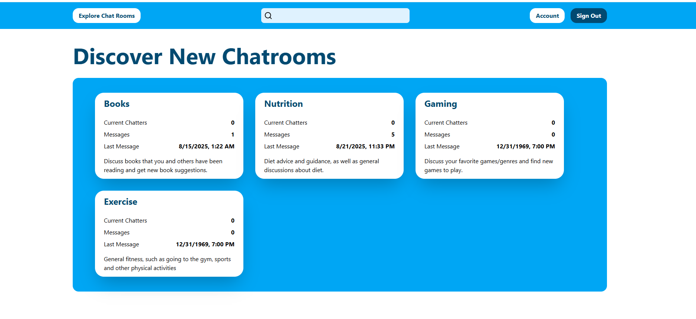
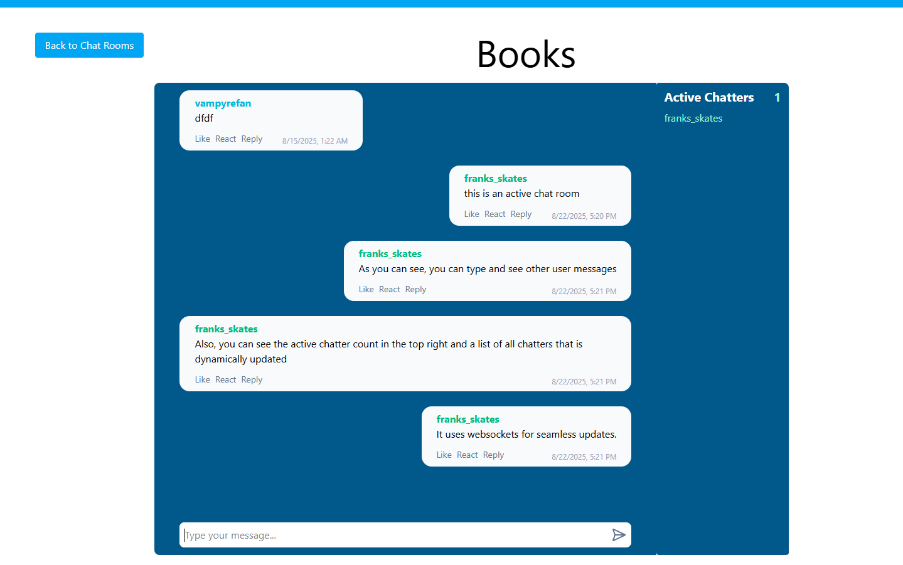

# Chat-App-Backend

## Live Demo

https://chat-app-frontend-sepia-rho.vercel.app/



## Project Description

This is a chatroom application that utilizes websockets for a seamless and responsive chatting experience. Users can sign-up with a secure sign-up page utilizing react-hook-form for a responsive user experience and field validation. The users and chatrooms are stored in a secure postgresql database that is hosted in Railway.

## Main Features

-   **Websocket Instant Messaging**

Users connect to a room in Socket.IO via the Node-Express backend and can send messages to all other users in that chatroom via websockets, which instantly updates the chatroom for all users without requiring a page refresh creating a seamless user experience.

-   **PostgreSQL Database for Users and Messages**

All application data, such as users, chatrooms, various message types and more are stored in a secure PostgreSQL database that is hosted on Railway.

The structure is actually more complex for this project than you might think. Message table has a one-to-many relationship with reactions and likes, additionally messages can be a reply to another message and message read state is tracked in the "chat_reads" table.

To keep track of messages between users, a "dm_threads" table was created which has a one-to-many relationship with "dm_thread_participants", which keeps track of the users in the dm thread. This is engineered with future-proofing in mind because there could be "dm_threads" with more than two users in the future.

-   **Redis In-Memory Database to Track Room Users and Room State**

User lists and counts are stored in Redis In-Memory Database to keep track of when users join and leave rooms to keep an accurate user count for each room that is instantly updated and transmitted to all users via web-sockets.

It has extensive testing and security measures in check to keep an accurate user count, such as adding users on connection and removing on disconnection, as well as adding users to the specific rooms when they join or leave. Even if this all fails somehow, there is a recurring interval function that runs every minute and checks if the redis user has expired from the chat room and it will send a web-socket request to update the clients web page.

-   **User Authentication and Security**

Users passwords are securely hashed using bcrypt and there is both client and server side password validation to ensure security measures are met (character limits, Capital letters, etc).

Users are authenticated using JWT Tokens, which are stored in local storage and automatically updated via refresh token on expiry and sent in the headers to all auth protected backend routes.

## Tech Stack

-   **Frontend**: React/Vite/Typescript/Tailwind CSS with react-router for SPA page navigation.

-   **Backend**: Node-Express/Typescript with Drizzle ORM to connect to the PostgreSQL database. Live dev updates using nodemon and using libraries, such as: dotenv, jsonwebtoken, nodemon, redis, socket.io, bcryptjs, express, cors, drizzle-orm.

-   **Websocket Messaging**: Socket.io Node library for connecting the frontend to the backend with websockets enabling real-time communication and notifications.

-   **Database**: PostgreSQL connected to the backend via Drizzle ORM.

-   **Hosting**: The backend node server is hosted on Railway for a cheap, easy and popular hosting solution. Many other people use the Railway hosting platform, so it's a safe future-proof bet. Additionally, it was quite easy to setup by connecting directly to my project GitHub repository, which automatically re-deploys on push if there are no build errors.

The PostgreSQL database is also seamlessly hosted on railway, allowing for direct access from the backend.

The frontend is hosted on Vercel as an SPA (Single Page Application), there may be some additional configuration required as the web page does show an error message when the user refershes the page, which is an easy fix and I will update shortly. The following code should fix it.

```
{
  "rewrites": [
    { "source": "/((?!api|assets|.*\\..*).*)", "destination": "/index.html" }
  ]
}
```

## Problems Encountered

To be continued...

## What I learned

To be continued...

## Project Replication Steps

To be continued...
